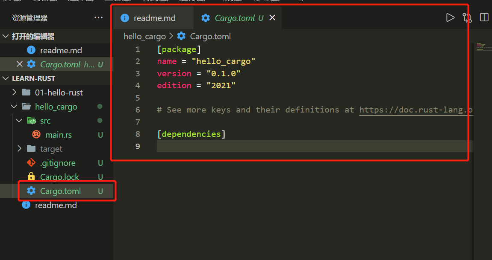

# Rust学习笔记

## 0. 参考资料

[Rust Programing Language](https://doc.rust-lang.org/book/title-page.html)

## 1. 环境安装

### 1.1 windows安装

+ 步骤： 

  + C++环境安装：根据文档中，windows可以先进入[visual-cpp-build-tools](https://visualstudio.microsoft.com/zh-hans/visual-cpp-build-tools/)下载对应的工具，安装完成后，重启电脑即可
  + Rust安装：[rust下载](https://forge.rust-lang.org/infra/other-installation-methods.html)选择对应的版本下载即可
  + 测试：使用`rustc --version`能看到对应的版本号就是安装成功啦

### 1.2 MacOS安装过程

+ 步骤：
    + 运行安装命令
    ```bash
        # 运行命令
        curl --proto '=https' --tlsv1.2 https://sh.rustup.rs -sSf | sh
    ```
    + 查看提示，成功安装后，命令行会提示 **Rust is installed now. Great!**


## 2. Hello Rust

### 2.1 第一个Rust代码

```rust
fn main() {
    println!("hello Rust");
}
```

+ 关键分析
  + 第一行的fn用于声明一个函数
  + main函数在rust函数中是作为第一行代码执行的
  + println后面的`!`，这是macro的宏，如果加了`!`代表你调用的是rust的宏而不是普通函数
  + `;`代表该行语句结束

### 2.2 编译rust

```bash
rustc ./helloRust.ts
```

**结果**: 编译之后我们会拿到两个文件`helloRust.exe`和`helloRust.pdb`

其中这个`exe`文件就是在windows上直接可以执行的文件


### 2.3 和动态语言的区别

动态语言：js，python，ruby等需要我们在运行的平台安装对应的解释器，通过解释器将代码转换为字节码，通过字节码解释器来读取并执行字节码

编译型语言：将代码编译成二进制可执行文件，平台上可以不安装任何解释器


## 3. Hello Cargo

### 3.1 cargo是什么

  1. cargo是一个构建系统和包管理工具
  2. 用来管理rust工程和处理许多任务（构建代码、下载包）
  3. cargo在安装rust的环境时，会自动安装，所以这里的话，直接调用
     ```bash
      # 可以直接看到对应的cargo版本
      cargo --version
     ```
  > 类似nodejs中的npm，通过scrips来帮我们执行相应脚本，通过install来安装包

### 3.2 cargo工程的创建

#### 3.2.1 创建

使用`cargo new [projectName]`来创建一个新的工程
```bash
cargo new hello_cargo
```



#### 3.2.2 目录解析

创建的目录包括：

+ cargo.toml：用于定义包和信息`[package]`和依赖`[dependencies]`，其他还有别的配置如下：

  

+ 源文件目前是放在src的目录下的

#### 3.2.3 toml文件中需要注意的点

`[package]`下面的一些配置:

+ build：用于指定build来指定这个包用源码的方式编译

  > 比如在rust中引用了比如C的库，这些东西编译就放在一个build.rs中，会通过源码的方式进行编译

+ include和exclude：用来指定那些包需要被打包或发布，可以通过`carge package --list`来查看

+ publish: 用来指定包是否发布到包仓库，==保护包的私有性==


